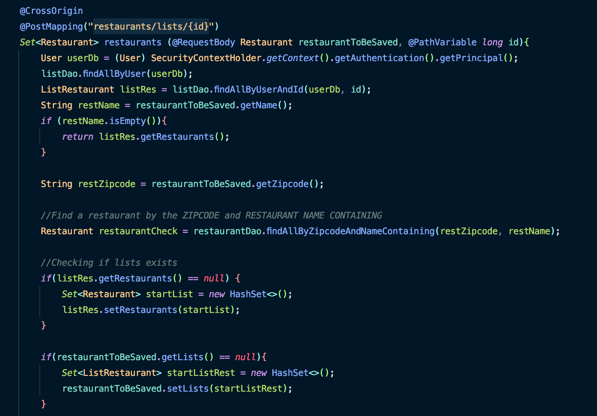
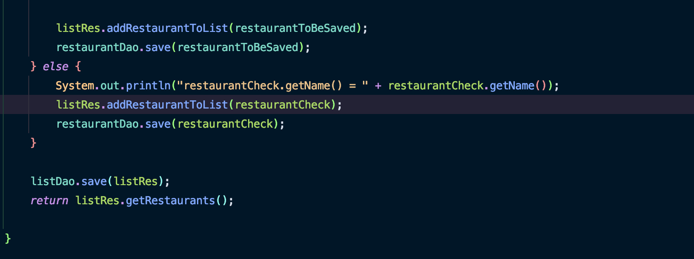
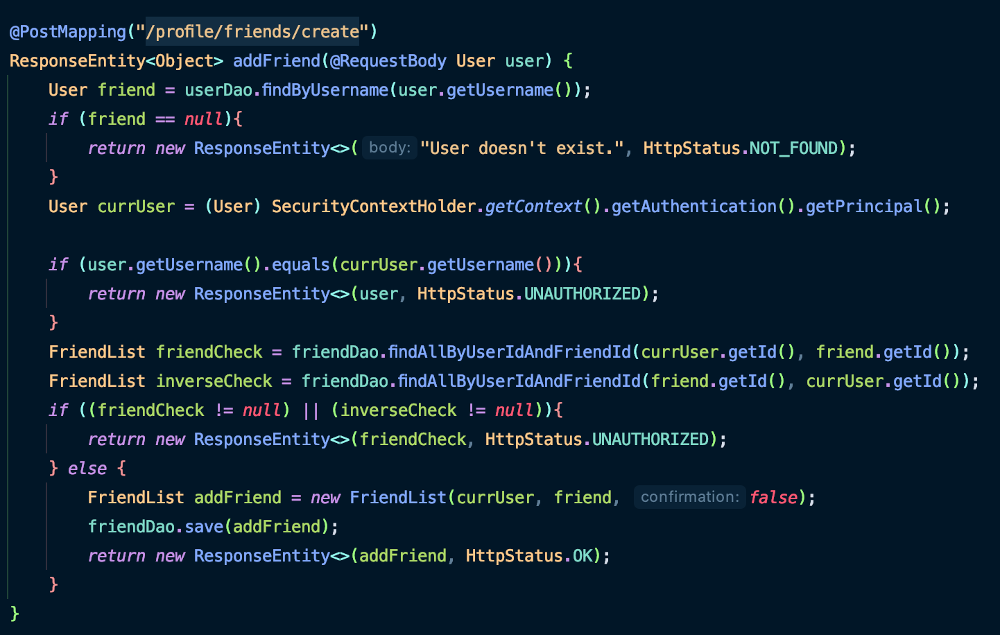
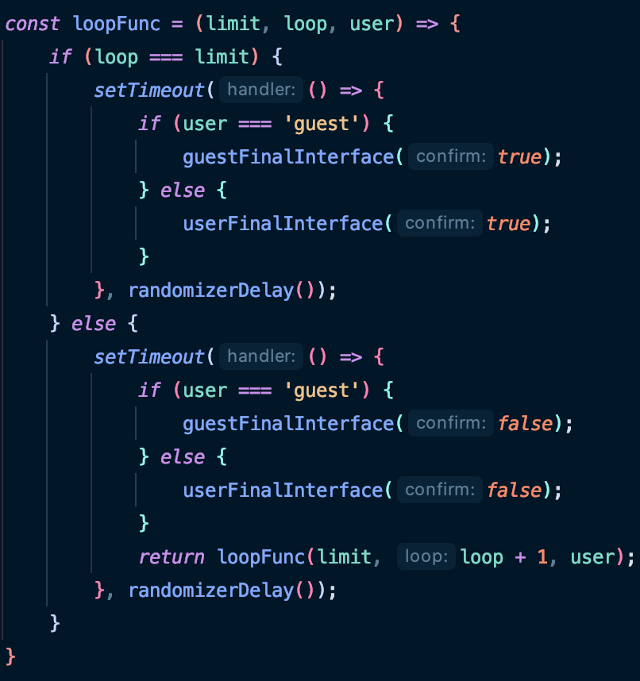
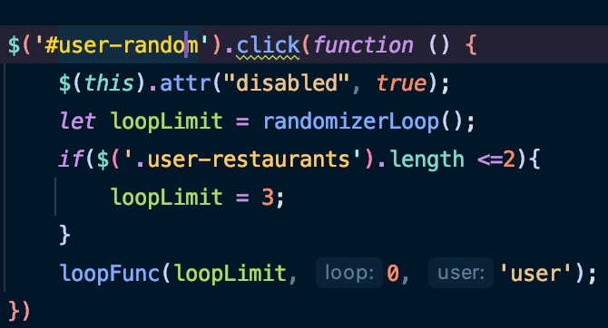
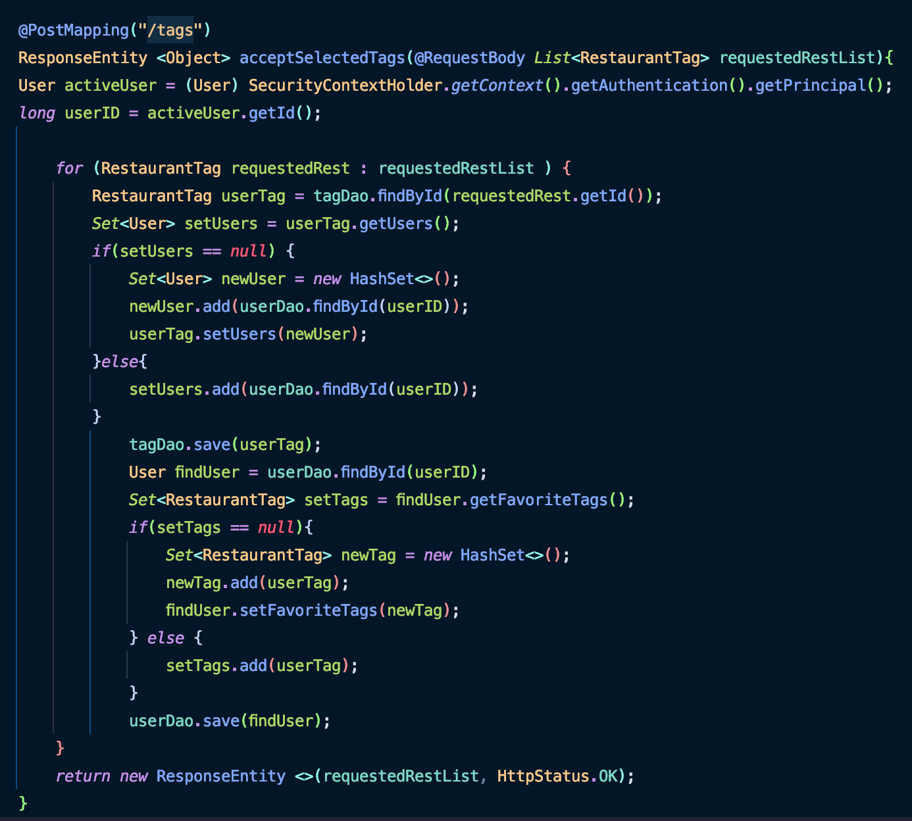

<h1 align="center">⭐️ A little bit about Yum-Rando ⭐️</h3>
 

Yum-Rando is a game-changing web application built to answer the age-old question of “what’s for dinner?” Built using geolocation data from the Zomato restaurant API, Yum-Rando can suggest a randomized restaurant for you that is near your location. You are also able to build a list using local storage to randomize through. If you chose to become a registered user you will have the ability to further customize your experience through self-generated lists that are saved to our database with a unique title of your choosing, as well as the ability to review a restaurant and adding photos through the Filestack API, and share your experience with your friends.

### Learn all about us!
1. [Try our site out!](https://github.com/yum-rando/yumrando#Try-us-out!)
2. [Technology and Software](https://github.com/yum-rando/yumrando#Technology-and-Software:)
3. [Developer Favorites](https://github.com/yum-rando/yumrando#Developer-Favorites:)
4. [Contact Us](https://github.com/yum-rando/yumrando#Contact-Us)

### Try us out!
<a href="https://yumrando.com/" target="_blank">yumrando.com</a>

### Technology and Software:

<h5>Frontend</h5>
- Html 5 
- JavaScript/EcmaScript 6 
- Bootstrap 
- jQuery 

<h5>Backend</h5>
- Spring Boot  
- Hibernate ORM + JPA 
- Thymeleaf 
- MySQL 
- Java  

<h5>Resources</h5>
- [Zomato Restaurant API](https://developers.zomato.com/) 

### Developer Favorites:

<h2 align="center">Favorite Aspects and Challenges From Our Developers</h2>

Chelsea:

Favorite aspect & a challenge =>

To add a restaurant to a list required the server to return a Rest Controller. In order to add or update the restaurant to the database, it required checking the restaurant to be added via its name and zip code. If it was not in the system, it would then create an empty set of lists for the restaurant then save the new restaurant. If the check was verified, then you would simply update the restaurant to be saved by adding the new list its set of lists. The challenge here was updating a many-to-many relationship between the lists and restaurants and letting the server know if the chosen restaurant was in the DB to save it. Creating methods that specifically update this type of relationship only, benefited keeping the database clean by not creating a new list every time a user added a restaurant.

Code Snippet :

  
  

Roberto:

Favorite aspect & a challenge =>

The add friend request allows a user to send a friend request based on the friend's username. This feature checks to the database to make sure the target username exists and that the relationship between the users doesn't already exist. Once confirmed the friend request is created for the other user to accept or reject through a confirmation boolean value. A problem that was encountered with this feature was that both sides of the relationship had to be checked to be able to confirm if the relationship exists. To fix this problem, the server checks to see if the logged in user initiated the friendship with the targeted user or if the logged in user was the receiver of the friend request by the targeted user.

Code Snippet:

The randomizer functionality runs on various randomly generated values. It checks for the length of the array of the displayed list, generates random index values alongside randomly generated milliseconds for the time delay, and generates a random value for the number of times the randomizer runs through a loop. Once the loop is completed, the result is shown through the use of a JQuery click action on the final chosen div which results in a modal showing the restaurant's information. A problem that was encountered was with having the randomizer be responsive to an array with less than 2 restaurants. The solution was to add a layer of filtering that makes sure to lower the ceiling of the randomly generated number of loops to ensure that a random result is generated at a much faster rate.

Code Snippet:

  
  
  

Rocco:

Favorite aspect & a challenge =>

The Restaurant Cusisine Tags were my favorite aspect to create an also one of the most challenging aspects for me to code. The main issue arrose because the Zomato API returned JSON objects and the cusines were jsut one of many object properties we wanted to grab and store into the database. To do so I created a Rest Controller using the SpringBoot Framework thst would accept the JSON objects that were being sent from the front end and save them to the database. To specifically save cuisine tags to the datatabase I had to first validate that the user was an authorized user which I did through the SpringSecurity component then I had to check to see if the tags I grabbed from the api were tags that were already selected in a user created list then after finding all the cuisine tags that were attached to the user's list then a JSON object was sent back with all the selected tags which was then saved to the database using the Jpa repositiories and Jpa Hibernate feature of SpringBoot.

  
Code Snippet:

  

### Contact Us

<h2>Amanda Garrison Woods</h2>
 
<ul>
  <li><a href="https://github.com/amandagwoods" target="_blank">GitHub</a></li>
  <li><a href="https://www.linkedin.com/in/amandagarrison787/" target="_blank">LinkedIn</a></li>
</ul>

<h2>Chelsea Rolland</h2>
 
<ul>
  <li><a href="https://github.com/ChelseaRolland" target="_blank">GitHub</a></li>
  <li><a href="https://www.linkedin.com/in/chelsea-rolland-657ab31b7/" target="_blank">LinkedIn</a></li>
</ul>

<h2>Roberto Cuyar</h2>
 
<ul>
  <li><a href="https://github.com/robertocuyar" target="_blank">GitHub</a></li>
  <li><a href="https://www.linkedin.com/in/roberto-cuyar-5b9815124/" target="_blank">LinkedIn</a></li>
</ul>

<h2>Rocco Paccione</h2>
 
<ul>
  <li><a href="https://github.com/roccopaccione" target="_blank">GitHub</a></li>
  <li><a href="https://www.linkedin.com/in/rocco-paccione0321/" target="_blank">LinkedIn</a></li>
</ul>

